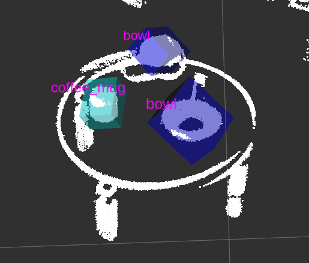

# OBJECT DETECTION AND RECOGNITION IN 3D Point Cloud scene



### DISCLAIMER: project is still in development stage, I try to keep master branch as updated and functional as possible.

## Dependencies
- ROS Kinetic
- PCL 1.8
- Opencv 2
- Python 2.7
- Numpy
- cv2
- TensorFlow
- Keras

## Nodes
```
	|-> tf_emitter
	|-> segmentationNode
	|-> classifierNode
	|-> RViz
	`-> pcd_to_pointcloud
```

### tf_emitter
- publishes world frame for RViz 

### segmentationNode
- publishes all the segmented clouds to /pcVector

### classificationNode
- subscribes /pcVector and classifies every segmented pointcloud using 3DCNN and publishes bounding boxes as MarkerArray

### Rviz
- used for visualization

### pcd_to_pointcloud
- to publish scenes for testing

## Note
/bin - contains .pcd scenes which are broadcasted


## Dataset
https://rgbd-dataset.cs.washington.edu/dataset/rgbd-dataset_pcd_ascii/

## Directory Structure for DataSet

```
Dataset_RGBD
	|
	├── apple_1
	|		|── apple_2_4_9.pcd
	|		.
	|		`── apple_2_1_111.pcd
	├── banana_1
	|		|── banana_1_4_6.pcd
	|		.
	|		`── banana_1_4_80.pcd
	├── bowl_1
	|		|── bowl_2_1_9.pcd
	|		.
	|		`── bowl_3_4_119.pcd
	├── calculator_1
	|		|── calculator_2_1_2.pcd
	|		.
	|		`── calculator_3_2_138.pcd
	└── coffee_mug_1
	 		|── coffee_mug_3_4_6.pcd
	 		.
	 		`── coffee_mug_3_4_83.pcd

```

## Training the classifier
```
rosrun robot_vision trainer.py
```

## To run package
```
roslaunch robot_vision robot_vision3.launch
```
